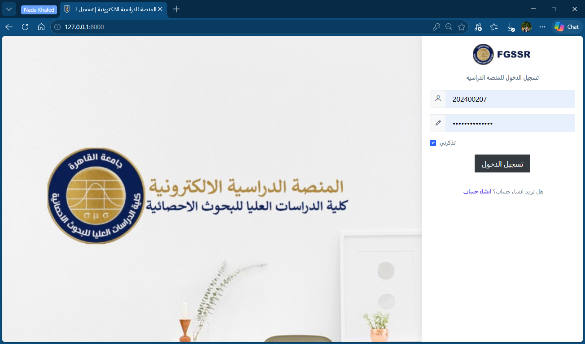
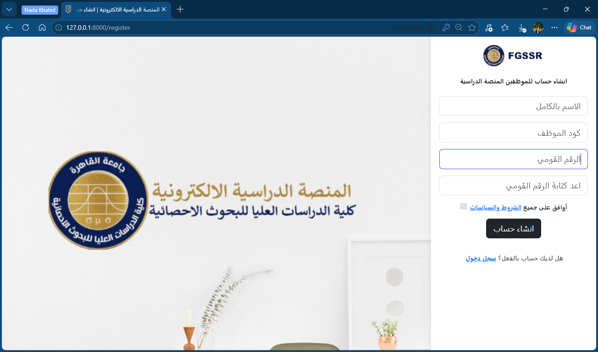
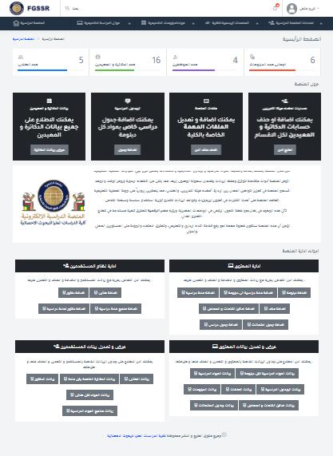
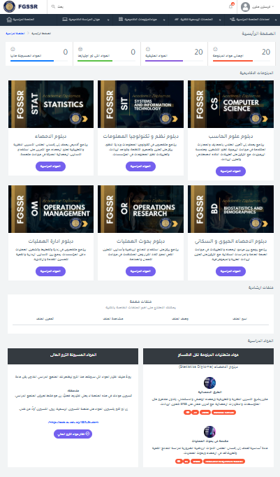
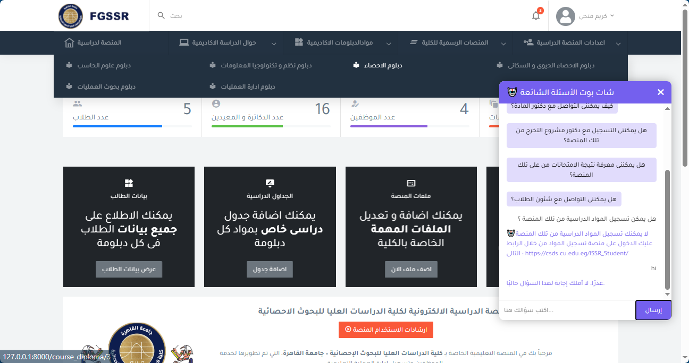
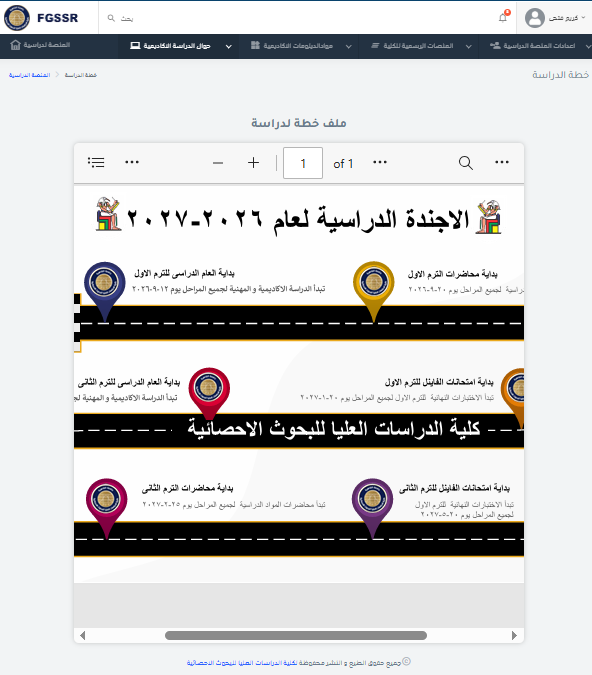

# 🎓 FGSSR Academic Study Platform 🌐

[](https://laravel.com)
[](https://www.mysql.com)
[](#)
[](https://cu.edu.eg)

An integrated, web-based Academic Study Platform and Learning Management System (LMS) custom-built for the **Faculty of Graduate Studies for Statistical Research (FGSSR), Cairo University**. 

Aligned with Egypt’s Vision 2030 for Digital Transformation in Higher Education, this platform resolves the inefficiencies of fragmented university services by establishing a centralized, secure, and collaborative ecosystem for students, faculty members, and system administrators.

---

## 📌 Table of Contents
- [✨ Key Features](#-key-features)
- [💻 Tech Stack](#-tech-stack)
- [🏗️ System Architecture](#️-system-architecture)
- [🗄️ Database Design](#️-database-design)
- [👥 Role-Based Access Control (RBAC)](#-role-based-access-control-rbac)
- [📸 System Screenshots](#-system-screenshots)
- [🚀 Installation & Setup](#-installation--setup)
- [🔮 Future Roadmap](#-future-roadmap)
- [👥 The Team & Acknowledgments](#-the-team--acknowledgments)

---

## ✨ Key Features

The platform consists of several highly-integrated subsystems engineered under rigorous software engineering principles:

1. **🔒 Authentication & Access Control:** Secure, multi-user login workflows with custom dashboards based on designated system roles.
2. **📚 Learning & Content Management (LMS/CMS):** Allows faculty members to seamlessly upload, update, and organize academic materials, documents, and multi-format lecture files.
3. **📅 Intelligent Timetable System:**
   - Interactive, real-time weekly lecture and study schedules.
   - Centralized exam schedule management showing dates, times, and exact venues.
4. **💬 Real-Time Internal Chat System:** An internal communication portal enabling students to directly message professors and teaching assistants for academic guidance.
5. **🔔 Smart Notification Engine:** Instant triggers keeping all target users informed about newly uploaded content, schedule updates, or direct messages.
6. **🏫 Place & Venue Management:** Tracks campus lecture halls, auditoriums, and computer labs to strictly avoid scheduling overlaps.
7. **🔍 Advanced Search Architecture:** High-speed querying capabilities to quickly find courses, student rosters, or specific schedules.

---

## 💻 Tech Stack

* **Backend Framework:** [Laravel](https://laravel.com) (PHP) – Utilizing the robust Model-View-Controller (MVC) architectural pattern for ultimate scalability, clean code isolation, and easy maintenance.
* **Database Engine:** [MySQL](https://www.mysql.com) – A relational database schema structured to guarantee strict data integrity, operational speed, and reliable foreign key constraints.
* **Frontend Layer:** Blade Templating Engine, HTML5, CSS3, JavaScript (Engineered with Responsive Web Design practices for seamless desktop and mobile compatibility).
* **Development Methodology:** Formulated using the **Waterfall Model** for the Software Development Lifecycle (SDLC), ensuring definitive phases from explicit requirements engineering to systematic verification.

---

## 🏗️ System Architecture

The technical design and system boundaries are rigorously modeled through established architectural standards:
* **UML Modeling:** Fully documented using formal Use Case, Activity, Class, Sequence, Component, and Deployment diagrams.
* **C4 Model:** Modeled across Context, Container, Component, and Code levels to deliver transparent structural insights for engineering reviews.
* **Data Flow Diagrams (DFD):** Structured data streaming blueprints mapped systematically across Level 0, Level 1, and Level 2 processes.

---

## 🗄️ Database Design

The data layer is engineered using an **Extended Entity-Relationship (EER) Model** ensuring deep structural normalization. It translates complex academic dependencies into isolated relation tables (`users`, `roles`, `courses`, `diplomas`, `messages`, `schedules`, `places`) enforcing `ON DELETE CASCADE` constraints and precise data consistency rules.

---

## 👥 Role-Based Access Control (RBAC)

* **👤 System Administrator (Admin):** Holds complete operational dominance. Manages user registries, maps out academic diploma structures, overrides venue timetables, and controls global configuration profiles.
* **👨‍🏫 Faculty Member / Instructor:** Dictates course delivery. Uploads core learning syllabus materials, tracks students enrolled in their respective modules, and offers academic chat support.
* **🎓 Student:** Interacts with the learning ecosystem. Reviews enrolled courses, downloads documents, tracks midterms/finals tables, and initiates messaging loops with faculty staff.

---

## 📸 System Screenshots

### 🔑 1. Authentication Interfaces
*Replace the placeholder paths below with your actual screenshot images (e.g., `screenshots/login.png`).*

| Login Screen | Registration Screen |
|:---:|:---:|
|  |  |

### 📊 2. User Dashboards & Core Systems
| Admin Control Panel | Student LMS Portal |
|:---:|:---:|
|  |  |

| Real-Time Chat System | Academic Timetables |
|:---:|:---:|
|  |  |

---

## 🚀 Installation & Setup

Follow these explicit commands to set up the FGSSR Academic Study Platform environment locally:

### Prerequisites
Ensure your local development machine has:
* PHP >= 8.1
* Composer
* MySQL Server
* Node.js & NPM

### Setup Instructions
 **Clone the Repository:**
   ```bash
   git clone [https://github.com/your-username/fgssr-academic-platform.git](https://github.com/your-username/fgssr-academic-platform.git)
   cd fgssr-academic-platform
   ## 📦 Installation

### 1. Install Vendor Dependencies

```bash
composer install
npm install
npm run dev
```

### 2. Configure Environment Parameters

Create a local configuration profile from the template:

```bash
cp .env.example .env
```

Open the `.env` file and configure your database credentials:

```env
DB_CONNECTION=mysql
DB_HOST=127.0.0.1
DB_PORT=3306
DB_DATABASE=fgssr_platform
DB_USERNAME=root
DB_PASSWORD=your_mysql_secure_password
```

### 3. Generate Application Encryption Key

```bash
php artisan key:generate
```

### 4. Execute Database Migrations and Seeders

Build the database tables and populate the required initial data:

```bash
php artisan migrate --seed
```

### 5. Establish Storage Linkage

Create a symbolic link for public storage to enable profile images and uploaded course files.

```bash
php artisan storage:link
```

### 6. Boot the Local Development Server

```bash
php artisan serve
```

Open your browser and navigate to:

```text
http://127.0.0.1:8000
```

---

# 🔮 Future Roadmap

- 🎓 Expand the platform to fully support **Master's and PhD** academic workflows.
- 📝 Integrate a secure **Online Examination & E-Assessment** subsystem.
- 📊 Develop advanced **analytics dashboards** with predictive student performance metrics.
- 🎫 Implement a **Barcode-Based Attendance Management** system.
- 🧑‍🏫 Introduce an electronic **Supervisor Selection & Graduation Project Management** workspace.

---

# 👥 Team & Acknowledgments

This software platform was developed as a graduation project submitted in partial fulfillment of the requirements for the **Diploma in Computer Science** at the **Faculty of Graduate Studies for Statistical Research (FGSSR), Cairo University**.

## 👨‍💻 Developed By
### Team Leader :

**Nada Khaled(Al-Eaqrab)**
### Team Members :
**Dina Salah**  
**Christin Mokbel** 

---

## 🎓 Supervised By

**Prof. Dr. Shahira Azazy**

---

<div align="center">

### ❤️ Developed with Passion by FGSSR Computer Science Engineers

**June 2026**

</div>
